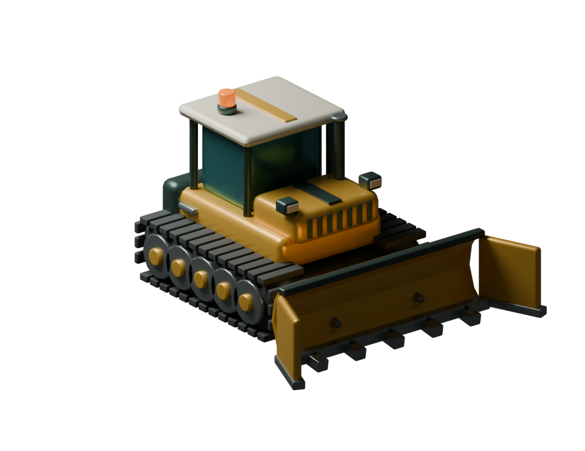

# GILT — Quarry Works

A fresh 3D gem-pushing game inspired by [Gem Miner Bulldozer](https://github.com/001ben/Gem-miner-vibe). Drive a small tracked machine through a sun-warmed quarry, sweep physical gems into a collector, and grow into a machine that can clear the whole operation.



## Play locally

Requires Node.js 22.12+ (verified with Node 24).

```sh
npm ci
npm run dev
```

Open the local address Vite prints. For a production build, run `npm run build`, then `npm run preview`. The build is static and can be served from any web host at its root path. The game has no backend; models, fonts and audio all run locally.

## GitHub Pages deployment

The Check and deploy game workflow runs tests and builds for the repository subdirectory. Pushes to main publish the dist artifact to GitHub Pages after checks pass; pull requests only test and build. The workflow can also be run manually from Actions.

Enable Settings > Pages > Source: GitHub Actions before the first deployment. The expected project URL is https://001ben.github.io/gilt-quarry-works/. Pages from a private repository requires a supporting GitHub plan; otherwise the repository must be public.

To check the same build locally:

    npm run build -- --base=/gilt-quarry-works/
    npm run preview -- --base=/gilt-quarry-works/

Only the compiled game is deployed. Browser saves belong to their origin, so the hosted game starts a separate save from localhost.

## Controls

| Control                        | Action                                    |
| ------------------------------ | ----------------------------------------- |
| W / S (or up / down arrows)    | Forward / reverse relative to the machine |
| Left / right arrows (or A / D) | Steer, including pivot turns at rest      |
| Space                          | Brake                                     |
| C                              | Follow / quarry overview camera           |
| Mouse wheel                    | Zoom                                      |
| M                              | Toggle audio                              |
| Escape                         | Pause / resume                            |
| ?                              | Operator's manual                         |

Drag anywhere on the quarry to bring up a floating joystick. Drag toward the direction you want to travel; drag farther for more throttle. Pull behind the dozer to reverse (the knob turns coral), and release to brake. Directions follow the camera in both views. Mouse dragging also works; enable optional touch direction/brake buttons from Pause. Keyboard controls remain available. The compact mobile HUD keeps funds, clearance and cargo visible; tap the ellipsis for sound, camera and help. Upgrade details expand within about four metres of a platform. Start your shift, then hold W to push the first blue heap onto the marked deposit belt. Park on a glowing platform to fund the rotating part above it. Coins transfer gradually and the platform bar fills. Partial payments survive leaving and reloading; each visit fits one level, then you drive off before funding another.

## The campaign

- 6,300 small physical gems in packed heaps: 1,800 quartz, 2,100 citrine and 2,400 amethyst.
- Two continuous 40-link track chains follow measured ground travel, reverse direction, and counter-rotate during pivot turns.
- Five engine/chassis levels, five blade widths (with wings from level three), five working collector configurations, an optional five-level front magnet, and a three-level gem refinery.
- Conveyors animate toward the hopper and grow from a 3 m span to 28 m, with an 11 m forward feeder at maximum level.
- A front boom magnet starts with a slow pull on small stones, then gains range and strength. Its five tiers reach 2.6 / 3.7 / 5.2 / 7.2 / 9.5 metres. It gathers loose stones across the blade and lets packed loads settle. Ground pulses show its reach.
- Engine and plow pads sit together in Quartz Flats; the conveyor stays opposite. Magnet upgrades live in Citrine Cut, and the refinery in Amethyst Reach. Quartz offers equipment through level 3; Citrine unlocks level 4 and magnet levels 1–3; Amethyst opens the final tiers.
- The Zone 3 vacuum pad fits a suction mouth, translucent ribbed hose and an open rear hopper. Its $700 / $1,400 / $2,800 tiers hold 40 / 90 / 180 gems and visibly enlarge the bin. Suction stops at capacity. Position the rear chute over the main conveyor or feeder to tip the bin, open the twin gates and drop physical gems onto the belt. Carried gems save with the machine and pay only when sold; cargo never prematurely completes a sector or overtime job.
- The refinery adds $1 per gem at each of its three levels, costs $450 / $900 / $1,800, and adds animated polishing drums behind the hopper.
- Occupied pads expand, fill with color and light around their perimeter, and lift the rotating part plus an overhead progress bar above the dozer.
- Two red key platforms sit beside the lane, turn green on purchase, and shrink away as the gates lower over 1.5 seconds. Keys are free after the preceding sector is completely cleared.
- Half-clearance contract bonuses, collection particles, batched flying coins into the bank and back to platforms, payment chimes and synthesized sound.
- Lucky Assay: park on the gold die platform in Quartz Flats to open a three-crystal coin game with faceted artwork, three-symbol reel windows, a marked center payline, scrolling strips, staggered stops, matching-symbol highlights and a win celebration. Only the center row pays. Choose a $10 / $50 / $100 / $500 stake. A triple returns 6.8× including the stake (6.25%); a pair returns the stake (56.25%); three different crystals return $0 (37.5%). RTP is 98.75% (1.25% house edge). Quarry coins only. Each result settles and saves before its reveal, with no autoplay.
- Overtime contracts after campaign completion: accept free jobs at the office opposite Lucky Assay, from Pause, or from the completion screen. Keep funds and equipment, rotate through all three sectors, earn richer per-gem payouts and completion bonuses. Deliveries grow from 600 to a maximum of 900 stones; only one contract is active at a time. Even an empty bank can accept a job.
- Completion screen also offers the original fresh fully upgraded victory lap. “Clear save & start again” in Pause has a separate confirmation and resets only this game’s progress.
- Automatic browser-local saves: remaining gems and their positions, money, upgrades, partial platform funding, contracts and machine position. Original sparse-layout saves migrate funds, equipment and clearance fractions to the new heap layout. New quarry reset requires an explicit confirmation.

The simulation is planar Matter.js physics with a Three.js presentation; it is not deformable terrain or a full vehicle dynamics simulator. Actual mobile-device performance and subjective campaign pacing remain to be evaluated beyond the included browser viewport checks.

Existing saves retain their owned equipment and partial payments. Saves migrate to version 6, including settled Lucky Assay results and active overtime deliveries; equipment already owned remains usable even if its next tier now requires a deeper sector.

## Original artwork

`art/gilt-dozer.blend` is the editable source. `art/build_assets.py` authors all dozer meshes and materials, exports the runtime GLB, and renders a review image. Rebuild using Blender 5:

```powershell
& 'C:/Program Files/Blender Foundation/Blender 5.0/blender.exe' --background --python art/build_assets.py
```

The renderer combines compatible static meshes by material while preserving the chassis, blade and two wing groups for progression. Missing UV attributes are normalized so the procedural plow plate cannot disappear during batching. The plow is a closed, thick, concave solid with end caps. A separate Blender-authored shoe is instanced along both track loops. The front magnet, refinery and conveyors are code-authored meshes in src/equipment.ts and reused for holographic previews. Both visual and physical dimensions come from `src/progression.ts`.

## Verification and design

```sh
npm test
npm run build
# With the dev server running on port 5173 and Microsoft Edge installed:
node tools/browser-check.mjs
node tools/drag-check.mjs
node tools/machinery-check.mjs
node tools/polish-check.mjs
node tools/performance-check.mjs current
node tools/late-game-check.mjs current
```

See [late-game pushing measurements](docs/late-game-performance.md), [conveyor performance measurements](docs/performance.md), [design and source study](docs/design.md) and [verification results](docs/verification.md). The original repository lives only in an ignored local `.reference` folder during development; none of its code or assets are shipped here.

## Project map

| File                                | Responsibility                                                    |
| ----------------------------------- | ----------------------------------------------------------------- |
| `src/progression.ts`                | Sector definitions, prices and shared machinery dimensions        |
| `src/simulation.ts`                 | Physics, platform funding, collections and validated saves        |
| `src/world.ts`                      | Quarry geometry, Blender model loading, rendering and camera      |
| `src/model.ts` / `src/tracks.ts`    | Safe model batching and constant-spacing track loops              |
| src/equipment.ts / src/platforms.ts | Animated conveyors, magnet geometry and drive-on holographic pads |
| `src/gems.ts`                       | Deterministic packed-heap layout                                  |
| `src/main.ts`                       | Inputs, HUD, menus, save lifecycle and game loop                  |
| `src/audio.ts`                      | Procedural engine and feedback sounds                             |
| `art/`                              | Reproducible original Blender assets                              |

Fonts are locally bundled from Fontsource (Barlow Condensed and DM Sans under their SIL Open Font Licenses). Third-party libraries retain their respective licenses.
